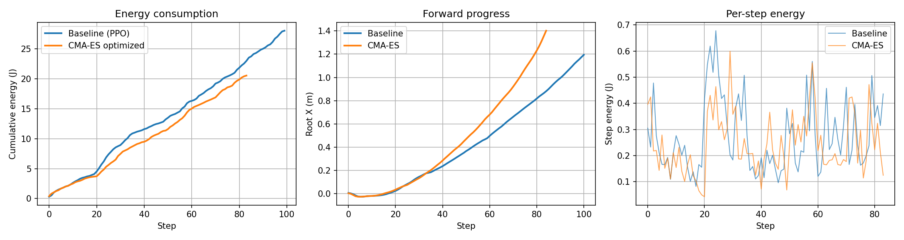

# Energieoptimierung eines humanoiden Roboters in MuJoCo


## 1. Projektübersicht

Ausgangspunkt ist ein vortrainiertes PPO-Modell, das den Humanoiden zum Laufen bringt, jedoch ohne Energieeffizienz. Ziel ist:

1. Ableitung eines **mathematischen Energiemodells** aus MuJoCo
2. Kopplung eines **externen Optimierers (CMA-ES)**
3. **Rückintegration** der optimierten Steuersignale in die Simulation

**Ansatz:** Trajektorienbasierte Residualoptimierung – CMA-ES optimiert nur die Abweichung $\delta u$ von der PPO-Basistrajektorie, um das Laufverhalten zu erhalten.

---

## 2. Energiemodell

Pro Zeitschritt wird die mechanische Energie direkt aus MuJoCo berechnet:

$$E_t = \Delta t \sum_{i=1}^{n} |\tau_i \dot{q}_i|$$

- $\tau_i$: Aktuatormoment (`data.actuator_force`)
- $\dot{q}_i$: Gelenkwinkelgeschwindigkeit (`data.qvel[6+i]`)
- $\Delta t$: Simulationszeitschritt (~0.015 s)
- $n = 17$ Aktuatoren

Die Implementierung erfolgt in `env_wrapper.py` und `energy_model.py`.

---

## 3. Zielfunktion

Der Optimierer minimiert über den Horizont $T$:

$$\min_{\delta U} J = \sum_{t=0}^{T-1} \bigl[ w_e E_t + w_s \|\delta u_t\|^2 - w_p \Delta x_t + w_{\text{pose}} C_{\text{pose}}(s_{t+1}) - w_a \mathbf{1}_{\text{alive}} \bigr]$$

mit $u_t = \text{clip}(u_t^{\text{base}} + \delta u_t, -1, +1)$.

Die Gewichte ($w_e, w_s, w_p, w_{\text{pose}}, w_a$) und Pose-Schranken sind in `config.py` definiert.

---

## 4. Externer Optimierer: CMA-ES

Der Suchraum ($100 \times 17 = 1700$ Dimensionen) ist zu groß für gradientenbasierte Verfahren. CMA-ES (covariance matrix adaptation evolution strategy) ist ein gradientenfreier, hochdimensionaler Optimierer, der iterativ eine Populationsverteilung anpasst.

---


## 5. Systemarchitektur
```
main.py                      ← Pipeline-Orchestrierung (4 Schritte)
│
├── config.py                ← Alle Hyperparameter (Gewichte, CMA-ES-Parameter)
│
├── env_wrapper.py           ← MuJoCo-Umgebung + Energiemessung
│     └── EnergyInfoWrapper  ← Berechnet E_t = Δt·Σ|τᵢ·q̇ᵢ| pro Schritt
│
├── energy_model.py          ← Mathematisches Energiemodell (reine Numerik)
│     ├── EnergyModelConfig  ← Gewichtungsparameter
│     └── EnergyObjective    ← Berechnet J(δU) für eine gesamte Trajektorie
│
├── cmaes_optimizer.py       ← Externer Optimierer (CMA-ES)
│     ├── _save/_restore     ← Zustandssnapshot-Mechanismus
│     ├── _simulate_window() ← Fensterweise Vorwärtssimulation
│     ├── _optimize_window() ← CMA-ES pro Fenster
│     └── optimize()         ← Gleitfenster-Hauptschleife
│
├── trajectory_executor.py   ← Ausführung der optimierten Trajektorie
│     └── run()              ← Replay + Videoaufnahme + Metrikerfassung
│
└── utils.py                 ← Logging, Vergleichsplot, JSON-Export
```
(Workflow.jpg)
---

## 6. Ergebnisse und Interpretation



| Metrik | Baseline (PPO) | Optimiert |
|--------|---------------|-----------|
| Gesamtenergie (J) | ~24 | ~22 |
| Vorwärtsbewegung (m) | ~0.8 | ~1.4 |

### 6.1 Interpretation der drei Diagramme

**Energieverbrauch (linkes Diagramm):**
Die optimierte Trajektorie verbraucht insgesamt deutlich weniger Energie als die Baseline. Allerdings bricht die optimierte Bewegung bereits nach 85 Schritten ab.

**Fortschritt (mittleres Diagramm):**
Die optimierte Trajektorie legt eine deutlich größere Strecke zurück.

**Schrittenergie (rechtes Diagramm):**
Die optimierte Trajektorie weist deutlich geringere Energieschwankungen auf.

### 6.2 Diskussion der Einschränkungen

Dieses Ergebnis liegt im erwarteten Bereich, aus drei Gründen. Erstens ist die Laufstrategie des ursprünglichen PPO-Modells selbst instabil (Sturz nach etwa 71 Schritten), wodurch der zulässige Suchraum des Optimierers stark eingeschränkt ist. Zweitens wurde der Fortschrittsterm (Vorwärtsbewegung) als Belohnung in die Optimierung aufgenommen, was das ursprüngliche Modell (kleinschrittiges Gehen) zerstört hat – daher kann das optimierte Modell nicht über längere Distanzen laufen. Obwohl der Optimierungserfolg begrenzt ist, dient diese Simulation als Proof of Concept: Es wurde eine mathematische Energiegleichung aus der Simulation abgeleitet, eine Schnittstelle zwischen externem Optimierer und Simulator (Speichern-Simulieren-Wiederherstellen-Zyklus) aufgebaut, die optimierten Ergebnisse zurück in die Simulation eingespeist und visualisiert sowie verglichen. Die Machbarkeit dieses Frameworks wurde demonstriert.

---
## 7. Installation & Ausführung
```bash
# Abhängigkeiten installieren
pip install gymnasium[mujoco] torch numpy matplotlib imageio cma

# Ausführen
python3 main.py --collect_steps 100 --window 20 --render
```

---
